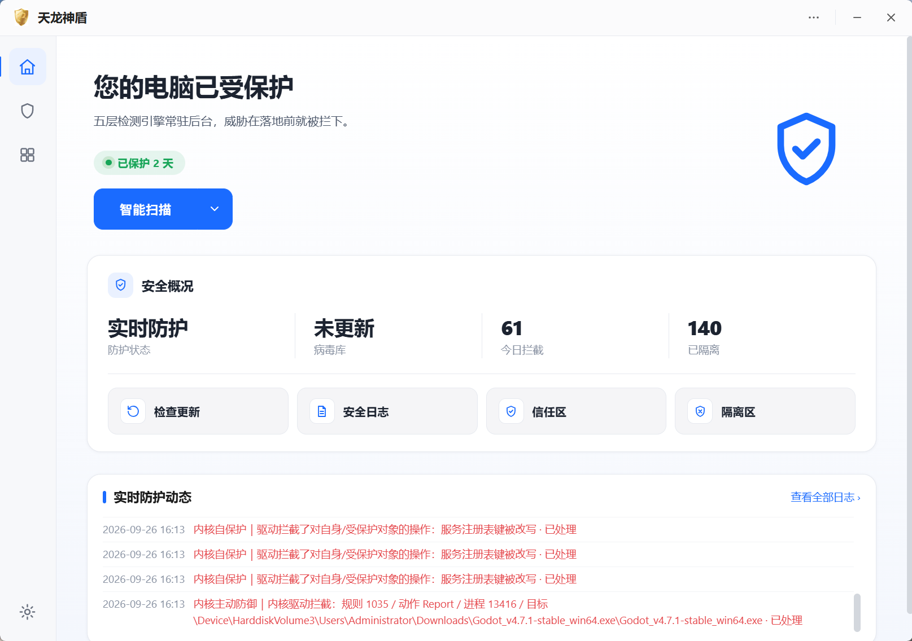
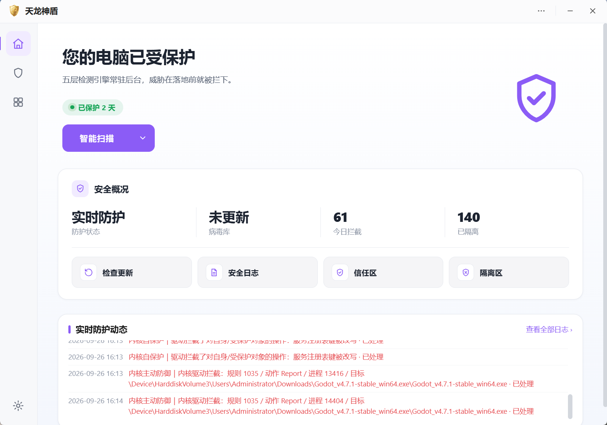
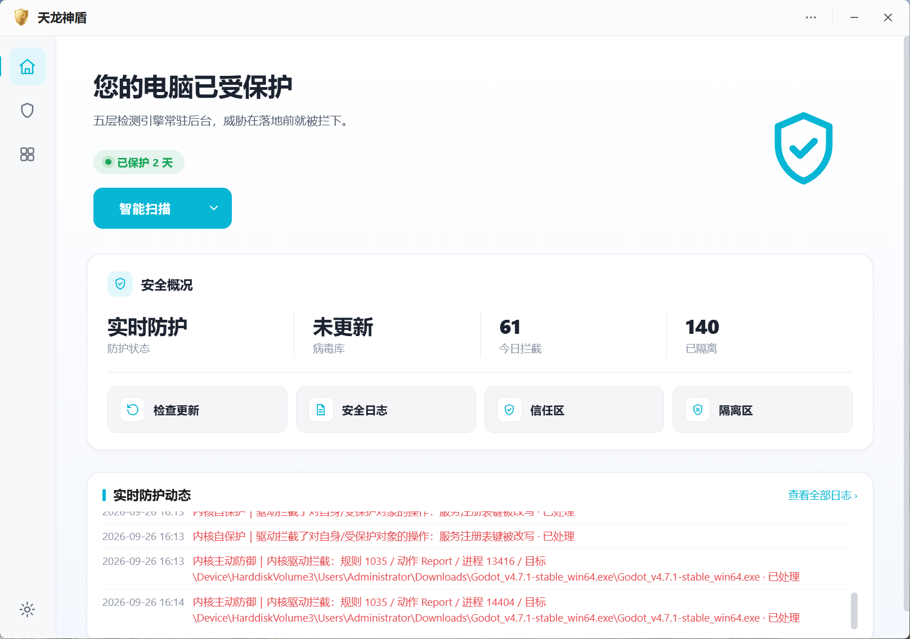
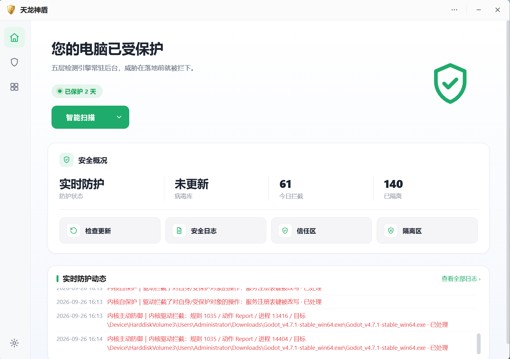
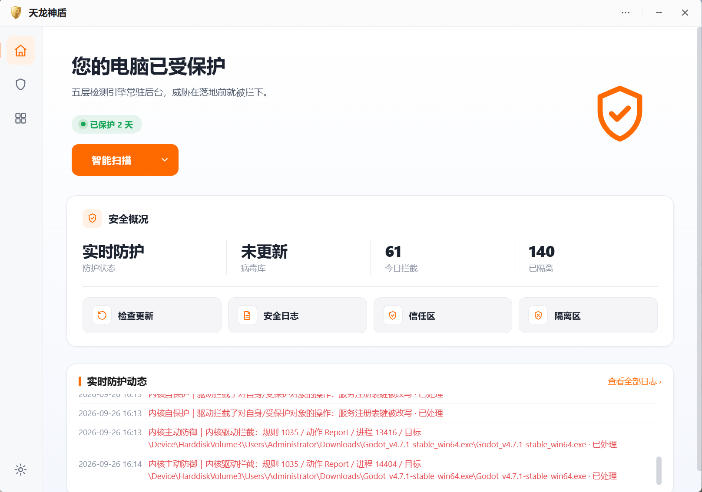
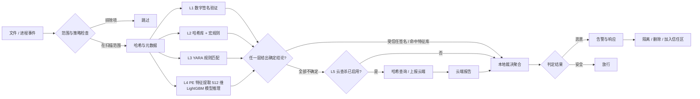
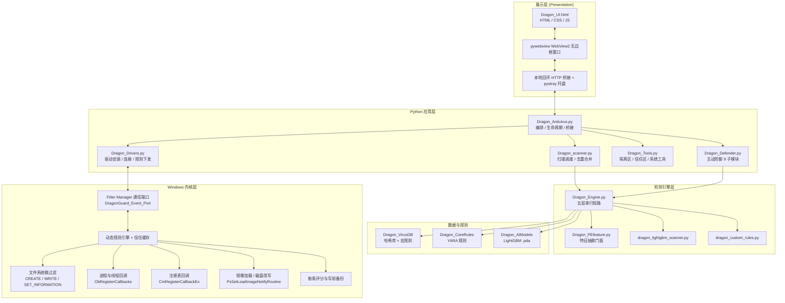

<div align="center">


# 天龙神盾安全中心 (Dragon-Antivirus)

**由五层检测引擎、YARA 规则、机器学习模型与内核级行为防护驱动的 Windows 终端安全平台**

[](LICENSE.txt)


[项目简介](#一项目简介) ·
[界面预览](#二界面预览) ·
[为什么选择](#三为什么选择天龙神盾) ·
[防护能力](#四防护能力总览) ·
[检测流水线](#五检测流水线) ·
[架构](#六系统架构) ·
[快速开始](#八快速开始) ·
[内核驱动](#十一内核驱动详解) ·
[许可证](#十八许可证与第三方组件)

</div>

---

> ⚠️ **许可证提示**：本项目为 **源码可得（source-available）** 项目，**不是 OSI 认证的开源项目**。
> 个人本地学习 / 研究 / 修改 / 自用均可；再分发、商用、企业部署须事先取得作者书面许可。
> 详见 [LICENSE.txt](LICENSE.txt)。GitHub 无法为此类组件级许可识别统一的 SPDX 标识，属预期现象。

> ⚠️ **安全提示**：本项目包含**内核态驱动**与**进程终止 / 文件拦截 / 引导区恢复**等高风险能力。
> 没有任何杀毒软件能保证检出所有威胁；请在虚拟机或可恢复数据的受控环境中评估，
> 保持备份，并在删除任何文件前先审阅告警。

---

## 目录

- [一、项目简介](#一项目简介)
- [二、界面预览](#二界面预览)
- [三、为什么选择天龙神盾](#三为什么选择天龙神盾)
- [四、防护能力总览](#四防护能力总览)
- [五、检测流水线](#五检测流水线)
- [六、系统架构](#六系统架构)
- [七、仓库结构](#七仓库结构)
- [八、快速开始](#八快速开始)
- [九、运行环境要求](#九运行环境要求)
- [十、防护开关与防护等级](#十防护开关与防护等级)
- [十一、内核驱动详解](#十一内核驱动详解)
- [十二、机器学习引擎](#十二机器学习引擎)
- [十三、内核规则引擎](#十三内核规则引擎)
- [十四、配置与本地数据](#十四配置与本地数据)
- [十五、安全与隐私](#十五安全与隐私)
- [十六、项目状态](#十六项目状态)
- [十七、贡献指南](#十七贡献指南)
- [十八、许可证与第三方组件](#十八许可证与第三方组件)
- [十九、链接与联系方式](#十九链接与联系方式)

---

## 一、项目简介

天龙神盾安全中心是一套**单进程桌面应用 + 内核过滤驱动**的混合架构 Windows 终端安全解决方案：用户态负责界面、编排、检测与响应，内核态负责行为拦截与不可绕过的强制处置。

在同一个应用里整合了：

- **五层串行检测引擎** —— L1 数字签名验证 / L2 哈希库 + 宏规则 / L3 YARA 规则 / L4 LightGBM 机器学习模型 / L5 云查杀（默认关闭），任一层给出确定结论即短路返回
- **用户态主动防御（9 大子模块）** —— 进程、文件、注册表、引导区、网络、内存、压缩包、自保护、诱捕
- **内核态强制防护（minifilter 微过滤驱动）** —— 文件 / 进程线程句柄 / 进程创建 / 注册表 / 镜像加载 / 磁盘改写 / 勒索行为，全部由内核回调在动作发生前裁决
- **工程化工具链** —— 规则校验、驱动部署、签名、构建核验、端到端触发测试，全部脚本化

本仓库有**双重设计目标**：既能作为一款可实际使用的安全软件，也可作为工程平台，用于研究恶意软件检测、Windows 内核驱动开发、规则驱动防护、机器学习模型训练与端到端拦截验证。

<div align="center">

</div>

---

## 二、界面预览

界面遵循「克制、专业、信息优先」的设计语言：左侧图标导航 + 首页防护仪表盘（受保护状态、安全概况四项指标、实时防护动态流）。内置 **5 套配色主题**，可在「设置 → 主题」中即时切换，无需重启。

<table>
  <tr>
    <td width="50%" align="center"><br/><sub><b>天空蓝（默认）</b></sub></td>
    <td width="50%" align="center"><br/><sub><b>梦幻紫</b></sub></td>
  </tr>
  <tr>
    <td width="50%" align="center"><br/><sub><b>湖光青</b></sub></td>
    <td width="50%" align="center"><br/><sub><b>清新绿</b></sub></td>
  </tr>
  <tr>
    <td width="50%" align="center"><br/><sub><b>活力橙</b></sub></td>
    <td width="50%"></td>
  </tr>
</table>

> 首页展示：实时防护状态（已保护天数 / 存在风险）、安全概况（防护状态 / 病毒库版本 / 今日拦截 / 已隔离）、常用功能入口（检查更新 / 安全日志 / 信任区 / 隔离区）与实时防护动态流。

---

## 三、为什么选择天龙神盾

1. **分层检测（Layered detection）** —— 数字签名 + 哈希病毒库 + 宏规则 DSL + YARA 模式匹配 + LightGBM 机器学习模型 + 可选云查杀，多层串行短路，各层独立可观测。
2. **行为导向防护（Behavior-oriented protection）** —— 不只看文件长什么样，更看进程在做什么：进程树处置、文件实时写入、注册表持久化回滚、引导扇区哈希比对、跨进程注入特征、压缩包爆发写入。
3. **内核级强制（Kernel enforcement）** —— 自研 KMDF 1.31 微过滤驱动（纯 C，约 1.4 万行），在 `FLT_PREOP` 阶段直接拒绝动作，用户态被绕过也不失守；同时提供**规则热加载**与**信任白名单**，避免"装了就蓝屏"。
4. **本地优先（Local-first）** —— 核心静态分析全部在终端完成，云查杀默认关闭，不上传任何样本；需要时可在设置里单独开启。
5. **运维工具完备（Operational tooling）** —— 隔离区 / 信任区、垃圾清理、启动项管理、系统修复、日志与活动报告，均可在界面内完成。
6. **可研究、可复现（Research-ready）** —— 规则 JSON 全字段开放、模型特征抽取开源、驱动工具链含"构建核验"（源码哈希 ↔ 产物哈希 ↔ 签名者 ↔ 功能特征）与端到端触发测试脚本。

---

## 四、防护能力总览

| 层次 | 能力 | 实现方式 |
|---|---|---|
| L1 签名信任 | Authenticode 数字签名验证，受信任签名直接判安全 | Windows `WinVerifyTrust` API |
| L2 特征库 | SHA256 / MD5 / imphash / 节哈希匹配 + `.srule` 宏规则 DSL | `Dragon_VirusDB/`（4000+ 条哈希 + 9 条宏规则） |
| L3 模式匹配 | YARA 规则编译与匹配（文件 + 进程内存） | `Dragon_CoreRules/` + `yara-python` |
| L4 机器学习 | 512 维 PE 特征 → LightGBM 树模型推理 | `Dragon_AIModels/*.pda` + `lightgbm` |
| L5 云查杀 | 哈希二次确认，可选、不降级、默认关闭 | CFTQ 云接口（HTTPS） |
| 进程防护 | 新进程枚举、父进程链回溯、双扩展名 / LOLBin / Temp 执行 / 挖矿特征规则、进程树终止 | 轮询枚举 + `SeDebugPrivilege` + `TerminateProcess` |
| 文件防护 | 目录变更实时监控、防抖扫描、勒索扩展名规则 | `ReadDirectoryChangesW`（每目录一线程）+ `os.walk` 轮询兜底 |
| 注册表防护 | 持久化键枚举、高危键写值回滚 | `winreg` + 备份快照 |
| 引导区防护 | 物理/逻辑扇区备份、哈希比对、异常恢复（**只备份与恢复，不主动写引导区**） | `\\.\PhysicalDrive` 直读 |
| 网络可见性 | 进程感知的 TCP 连接枚举、未签名外联告警 | IP Helper API（`GetExtendedTcpTable`） |
| 内存防护 | 注入模式特征、模块镂空（module stomping）检测 | 进程内存遍历 + API 调用记录 |
| 压缩包防护 | 短窗内压缩包爆发写入识别、Zone.Identifier 标记 | 状态持久化 + 频率统计 |
| 诱捕 | 诱饵文件布设、被改动即恢复并告警 | 模板 + 清单 + 哈希基线 |
| 自保护 | 病毒库 / 宏规则 / YARA 规则 / 引导区备份 / 基线 / 驱动镜像 / 规则 JSON 共 7 项，每 tick 比对 sha256，漂移即从基线副本还原 | 基线副本 + 周期巡检 |
| **内核强制** | 文件、进程/线程句柄、进程创建、注册表、镜像加载、磁盘改写、勒索行为 | **KMDF 微过滤驱动**（见[第十一节](#十一内核驱动详解)） |
| 恢复与维护 | 隔离区、信任区、垃圾清理、启动项、系统修复 | `Dragon_Tools.py` 应用服务 |

> 防护模块可逐项单独开关（6 个开关 × 3 个预设等级），部分主动防御能力默认关闭，由用户按需启用，详见[第十节](#十防护开关与防护等级)。

---

## 五、检测流水线

文件 / 进程事件进入引擎后的完整链路：



**短路语义**：任一层给出确定结论即返回，不再执行后续层；L5 云查杀仅在本地各层均无结论且用户显式开启时介入，且**只做二次确认，不降级本地结论**。

---

## 六、系统架构



---

## 七、仓库结构

```
.
├── Dragon_Antivirus.py            # UI 外壳（pywebview 窗口、托盘、前后端桥接、配置持久化）
├── Dragon_Defender.py             # 主动防御（用户态 9 大子模块 + 驱动接入）
├── Dragon_Engine.py               # 五层检测引擎（签名/哈希/YARA/LightGBM/云）
├── Dragon_scanner.py              # 扫描调度（多线程、并发去重合并）
├── Dragon_PEfeature.py            # PE 特征抽取门面（512 维）
├── Dragon_Tools.py                # 系统工具 / 隔离区 / 信任区 / 日志
├── Dragon_Drivers.py              # 内核驱动用户态桥（安装/连接/白名单/规则下发）
├── dragon_lightgbm_scanner.py     # L4 LightGBM 推理层
├── dragon_pda_features.py         # 模型特征定义与抽取
├── dragon_pda_store.py            # .pda 模型仓库读写
├── dragon_custom_rules.py         # 用户自定义规则
├── dragon_paths.py                # 路径定位（开发态/冻结态自适应）
├── Dragon_UI.html                 # 前端界面（WebView2 装载）
├── Dragon_CoreRules/              # YARA 核心规则库（L3）
│   └── Dragon_CoreRules.yar
├── Dragon_VirusDB/                # 哈希库 + 宏规则（L2）
│   ├── malware_hashes.tsv         #   SHA256/MD5 特征库
│   ├── macro.srule                #   宏/脚本类规则
│   ├── script.srule
│   └── misc.srule
├── Dragon_AIModels/               # LightGBM 模型（L4）
│   └── Dragon_AIModels.pda
├── Dragon-Drivers/                # 内核驱动源码（C / KMDF minifilter）
│   ├── src/                       #   15 个 .c 源文件（守护/规则/评估/勒索/自保护/IPC…）
│   ├── inc/                       #   DragonCommon.h / DragonProtocol.h（数据契约）
│   ├── Rules/                     #   内核动态规则 JSON（38 条）
│   ├── tools/                     #   部署 / 加载 / 签名 / 测试 / 核验工具链
│   ├── build/build_dragon.py      #   MSBuild 自动构建脚本
│   ├── Dragon-Drivers.sln         #   Visual Studio / EWDK 工程
│   └── Dragon-Drivers.inf         #   驱动安装信息（Altitude 328900）
├── tools/                         # 应用侧调试与维护脚本
│   └── defense_lab/               #   防御能力独立实验台
├── docs/                          # 功能清单、引擎重构开发文档
├── picture/                       # README 界面预览截图（5 套主题）
├── build_dragon.spec              # PyInstaller 打包配置
└── run_build.py                   # 一键构建脚本
```

---

## 八、快速开始

### 7.1 从源码运行（开发态）

推荐 Python 3.13（64 位）：

```powershell
git clone <本仓库地址> Dragon-Antivirus
cd Dragon-Antivirus
py -3.13 -m venv .venv
.\.venv\Scripts\Activate.ps1
python -m pip install --upgrade pip
pip install pywebview pystray pillow numpy lightgbm scikit-learn yara-python pefile
python Dragon_Antivirus.py
```

> **权限说明**：与受保护进程、注册表持久化键、物理磁盘、内核驱动交互的功能需要**管理员权限**。
> 未提权运行界面时，这些能力会自动降级为不可用（界面对应开关不生效），其余功能正常。

### 7.2 打包发布版

```powershell
.\.venv\Scripts\pip install pyinstaller
.\.venv\Scripts\python run_build.py
```

产物：`dist/Dragon_Antivirus.exe`（onefile），前端素材（`Dragon_UI.html` + 3 个 UI 图）与 `Dragon_AIModels/`、`Dragon_VirusDB/`、`Dragon_CoreRules/`、`Dragon-Drivers/` 会**外置**到 `dist/` 供运行期直接读取。

> **打包前必做**：先停止 `Dragon-Drivers` 驱动服务，否则 minifilter 会拦截 `base_library.zip` 写入，导致 PyInstaller 报 `Bad file descriptor`。

### 7.3 编译内核驱动

驱动源码位于 `Dragon-Drivers/`，纯 C + KMDF 1.31 微过滤器。

**方式 A —— Visual Studio 工程**：用 Visual Studio 2022（安装 *Desktop development with C++* + 匹配的 WDK/EWDK）打开 `Dragon-Drivers/Dragon-Drivers.sln`，选择 x64 / Release 生成。

**方式 B —— 脚本构建**：

```powershell
python Dragon-Drivers/build/build_dragon.py --config Release --target rebuild --sign
```

**驱动工具链**（`Dragon-Drivers/tools/`）：

| 脚本 | 用途 |
|---|---|
| `deploy_dragon.py` | 部署驱动服务 / Instances 注册表 / 签名策略；`--doctor` 做前置条件预检；全部动作需 `--yes` 显式确认 |
| `load_driver.py` | 一键加载：预检 → 按需放行签名 → 安装 → 登记客户端 → 启动 → 校验，并把 `sc start` 失败码翻译成中文诊断 |
| `sign_dragon.py` | 测试签名：自签证书 → `signtool` 签名 → 导出 `.cer`，并打印测试机侧步骤 |
| `verify_build.py` | 构建核验：源码哈希 ↔ 产物哈希 ↔ 签名者 ↔ 功能特征，回答"这个 .sys 是不是当前源码编出来的" |
| `validate_rules.py` | 规则 JSON 结构校验 |
| `test_all.py` / `test_triggers.py` | 端到端拦截验证（可复现触发用例 + 驱动开/关对照实验） |
| `audit_bsod.py` | 崩溃转储审计 |
| `dragon_client.py` | 用户态通信端口客户端（协议完整实现） |

> ⚠️ **驱动安全须知**：内核组件的构建与测试**只在带快照的隔离虚拟机中进行**；生产分发必须使用合规的代码签名（EV 证书 + 微软交叉签名或 WHQL）；不要为了加载开发构建而在主力工作站上关闭平台安全控制。实机测试请以 [`Dragon-Drivers/VM测试指南.md`](Dragon-Drivers/VM测试指南.md) 为唯一入口。

---

## 九、运行环境要求

| 配置 | 操作系统 | 权限 | CPU | 内存 | 空闲磁盘 |
|---|---|---|---|---|---|
| 最低 | Windows 10 20H1 或更新（x64） | 完整防护需管理员 | 1 GHz | 300 MB | 100 MB |
| 推荐 | Windows 10 21H2 / Windows 11 | 管理员 | 3 GHz | 500 MB+ | 200 MB+ |

**必需平台组件**：

- Microsoft Visual C++ 2015–2022 Redistributable（x64）
- Microsoft Edge WebView2 Runtime（界面渲染必需）
- 64 位 Windows（驱动为 x64 构建）

**开发 / 构建额外要求**：

- Python ≥ 3.13、PyInstaller ≥ 6.x
- Visual Studio 2022 + WDK/EWDK（仅编译驱动时需要）
- x64 构建环境，以及测试签名或生产签名工作流

> 实际资源占用取决于扫描范围、文件体积、启用的检测层数量、活跃工作线程数与实时防护开关状态。

---

## 十、防护开关与防护等级

界面提供 **6 个独立防护开关**，并内置 **3 档预设等级**（切换等级会同时改写这 6 个开关）：

| 开关 | 说明 | 低 | 中（默认） | 高 |
|---|---|---|---|---|
| `driver` | 内核驱动强制防护 | ✗ | ✓ | ✓ |
| `userMode` | 用户态主动防御（进程/注册表/引导/网络/内存等） | ✓ | ✓ | ✓ |
| `engineScan` | 文件操作触发引擎扫描 | ✗ | ✗ | ✓ |
| `realtime` | 文件实时监控 + 压缩包监控 | ✗ | ✓ | ✓ |
| `keyPositions` | 关键位置（启动项 / 系统目录）重点监控 | ✗ | ✗ | ✓ |
| `staticPoll` | 关键目录后台轮询静态扫描 | ✗ | ✗ | ✓ |

此外还有 **增强模式**：在 L4 层降低判定阈值（0.3 → 0.2），提高检出率，代价是误报概率上升，默认关闭。

---

## 十一、内核驱动详解

**Dragon-Drivers** —— KMDF 1.31 非 PnP 驱动 + Filter Manager 微过滤器，纯 C，x64，`FSFilter Activity Monitor` 组，**Altitude 328900**（对象回调 328900.0001 / 注册表回调 328900.0002）。源码约 **13,953 行**（15 个 `.c` + 2 个 `.h`）。

### 10.1 源文件职责

| 文件 | 职责 |
|---|---|
| `DragonEntry.c` | 驱动入口、KMDF 初始化、控制设备、过滤器注册、生命周期与拆卸 |
| `DragonComms.c` | 通信端口、10 条用户态命令、运行状态机、客户端授权 |
| `DragonSupport.c` | 池分配、IRQL/时间工具、段式通配符匹配、模式特异性评分 |
| `DragonJson.c` | 最小 JSON 扫描器（无递归、无分配、全程边界检查） |
| `DragonRules.c` | 规则数据库、JSON 解析、规则文件加载、白名单、信任缓存 |
| `DragonEvaluate.c` | 6 类规则评估、风险评分、频率阈值、进程树匹配 |
| `DragonResponse.c` | 作业队列（WDF 工作项驱动）、事件上报、进程终止、线程内存分析 |
| `DragonFileGuard.c` | Minifilter 文件回调（CREATE / WRITE / SET_INFORMATION） |
| `DragonBootGuard.c` | 裸磁盘 / 分区改写 IOCTL 拦截 |
| `DragonProcessGuard.c` | 进程创建退出通知 + 进程关系缓存 |
| `DragonRegistryGuard.c` | 配置管理器回调（创建 / 打开 / 删除 / 写值 / 删值） |
| `DragonObjectGuard.c` | 进程/线程句柄回调、线程通知、镜像加载通知 |
| `DragonSelfProtect.c` | 内置自保护（驱动镜像 / 规则目录 / 服务键 / GuardPaths / 客户端进程） |
| `DragonRansom.c` | 勒索防护：8 信号评分、高熵启发式、写前备份与一键恢复 |
| `DragonMetrics.c` | 诊断统计：回调计数、判定/处置计数、最近动作快照 |

### 10.2 拦截能力

| 功能域 | 机制 |
|---|---|
| 文件防护 | `FltRegisterFilter` → CREATE / WRITE / SET_INFORMATION（删除、重命名），`FLT_PREOP_COMPLETE` + `STATUS_ACCESS_DENIED` 直接拒绝 |
| 进程 / 线程句柄 | `ObRegisterCallbacks`（Process/Thread × Create/Duplicate），**剥离权限**而非直接拒绝，避免破坏正常调试与运维 |
| 进程创建 | `PsSetCreateProcessNotifyRoutineEx`，可阻断写 `CreationStatus` |
| 跨进程线程 | 线程通知 → 工作项 → 起始地址 → 内存类型 / 保护 / 大小 → 规则裁决 |
| 注册表 | `CmRegisterCallbackEx`，5 个通知类，支持 `ValueNames` 精确到值名的约束 |
| 镜像加载 | `PsSetLoadImageNotifyRoutine`（可写目录加载可执行映像告警） |
| 磁盘改写 | 4 个磁盘改写类 IOCTL，上报标识 `Disk_Wiper_Attempt` |
| 勒索防护 | 8 信号评分（大量修改 / 删除 / 重命名、扩展名变更、高熵写入、类型与目录离散度、写入频率）+ 写前备份 + 一键恢复 |
| 自保护 | 驱动镜像、规则目录、服务键、主程序 GuardPaths、客户端进程不可被改动或终止（编译期固化，不受规则清空影响） |

### 10.3 用户态 ↔ 内核态协议

通信端口 `\DragonGuard_Event_Port`（单客户端，协议版本 3，握手校验 Size / Version / Magic / ProcessId / 客户端镜像路径），10 条命令：

| 编号 | 命令 | 说明 |
|---|---|---|
| 1 / 2 | `AddWhitelist` / `RemoveWhitelist` | 增删通配符白名单（进入内核信任链） |
| 3 | `LoadRuleFile` | 热加载规则 JSON（NT 路径），上限 4 MB |
| 4 | `ClearRules` | 清空动态规则（内置自保护不受影响） |
| 5 / 6 | `AuthorizeUnload` / `RevokeUnload` | 授权 / 撤销驱动卸载 |
| 7 | `QueryState` | 查询运行状态 |
| 8 | `QueryRansom` | 查询勒索防护状态 |
| 9 | `RestoreFiles` | 勒索恢复（`0` 恢复并解封 / `1` 仅解封） |
| 10 | `QueryMetrics` | 查询诊断统计 |

事件结构 `{MessageCode, ProcessId, Path[1024]}`，PASSIVE 级 5 秒超时上报，高 IRQL 零超时。

---

## 十二、机器学习引擎

L4 层为**本地 PE 文件机器学习推理**，永远在线（不依赖网络）：

- **特征**：512 维，包含文件头 64KB 字节直方图、文件大小 / 熵 / 字符串统计、PE 头部结构（可选头、节表、数据目录）、节名 / DLL 名 / API 名哈希分桶
- **模型**：LightGBM 树模型，以 `.pda` 封装存放于 `Dragon_AIModels/`
- **抽取门面**：`Dragon_PEfeature.py`（对外 API：`FEATURE_SIZE`(512) / `pe_extract` / `pe_vector` / `feature_size`）
- **推理层**：`dragon_lightgbm_scanner.LightGBMScanner` 直接调用 `dragon_pda_features.extract_features`
- **增强模式**：判定阈值 0.3 → 0.2（提高检出、增加误报）

> ⚠️ **免责声明**：模型在训练集 / 验证集上显示的性能**不可**解读为真实世界通用检出率。可复现的评估需要：有记录的划分方式、类别平衡、去重策略、时序验证集、误报分析，以及针对未见恶意软件族的测试。

---

## 十三、内核规则引擎

驱动规则集 `Dragon-Drivers/Rules/DragonDriver_DefenderRules.json`（SchemaVersion 2，**38 条**）在驱动启动时自动从镜像目录 `Rules\` 子目录加载，也可由用户态热加载。

| 统计维度 | 分布 |
|---|---|
| 处置动作 | `Terminate` 20 条 / `Report` 18 条 |
| 规则类别 | Registry 14 / File 10 / Process 8 / Memory 3 / Thread 2 / Device 1 |

**动作分级的判据是"误杀代价"而不是"危险程度"**：

- **Terminate（上报 + 内核终止发起进程）** —— 正常软件绝不会做的行为：攻击本产品组件、关闭安全中心、删除卷影与还原点、清除事件日志、篡改引导链、向驱动目录投放文件、注册 LSA 安全包、劫持 Winlogon / IFEO / AppInit、向系统关键进程注入或窃取令牌。
- **Report（仅拒绝动作，不终止进程）** —— 合法软件同样会做的动作：自启动项与服务键写入、COM 注册、hosts 与代理配置、计划任务、启动文件夹、可写目录执行、LOLBin 携远程参数、脚本隐藏执行、账户与终端服务操作。拦下动作本身即达到防护目的，避免把正常安装器、运维脚本、备份与磁盘工具一起杀掉。

**规则字段**：`Code` / `Kill` / `Action` / `Priority` / `Category` / `Operations` / `Initiator` / `InitiatorExclude` / `Target` / `TargetExclude` / `ValueNames` / `HandleTypes` / `ObjectTypes` / `MinimumRiskScore` / `Threshold` / `TimeWindow`。

配套能力：段式通配符匹配（`*` `?`，大小写不敏感）、Include/Exclude 特异性评分裁决、句柄访问 / 线程内存 / 进程创建三套风险评分、`Threshold` + `TimeWindow` 频率阈值、128 槽 / TTL 300 秒信任缓存。

> 规则定义与字段语义见 [`inc/DragonProtocol.h`](Dragon-Drivers/inc/DragonProtocol.h) 与 [`交付说明.md`](Dragon-Drivers/交付说明.md)；规则校验可用 `Dragon-Drivers/tools/validate_rules.py`。

---

## 十四、配置与本地数据

所有可变数据统一放在**用户级目录**（而非 exe 同级目录，避免重建 / 升级时丢失）：

```
%LOCALAPPDATA%\天龙神盾\Data\
```

其中包含：配置、隔离区、信任区、运行日志、引导区备份、自保护基线、诱捕清单、勒索备份索引等。若该目录不可写，会自动回退到 exe 同级 `Data\`；首次切换时会一次性迁移旧的 exe 同级 `Data\` 中的关键数据（不含 WebView2 缓存与可再生的基线文件）。

WebView2 用户数据与诊断日志存放在当前用户的 LocalAppData 目录下。

> 报告配置类问题前，请先用默认设置复现，并从日志中移除敏感路径或文件信息。

---

## 十五、安全与隐私

1. **云查杀默认关闭**，本仓库构建不产生任何遥测上传；分析机密文件前请审阅当前配置。
2. **内核驱动与系统修复功能可能影响系统稳定性与数据可用性**，请先在虚拟机中验证。
3. 隔离、删除、启动项变更、系统修复与引导区恢复等操作**务必在可恢复数据上测试**。
4. 请勿使用仓库中的默认配置或凭据部署任何在线服务；上传样本前确认你有权上传。
5. 上传的恶意软件样本应视为**敌意文件**：使用隔离存储、最小权限、网络分段与严格的下载授权。
6. 发现安全漏洞时，请在维护者获得合理响应时间之前**不要公开漏洞利用细节**。

---

## 十六、项目状态

天龙神盾安全中心处于**积极开发**阶段。源码树可能包含面向后续版本的功能、实验模块、生成产物与研究数据，这些内容**不属于稳定发布包**。

- 终端用户：建议使用发布版产物（如有）。
- 开发者：请固定依赖版本，并明确验证构建所对应的精确修订版。
- 已知待办：内核规则在真实多安全软件共存环境下的误报调优（事件日志写入、可写目录映像加载等场景）；勒索恢复路径的 NT 路径 / Win32 路径一致性问题。

---

## 十七、贡献指南

欢迎 Issue 与聚焦的 Pull Request。

1. 提交新问题前请先搜索现有 Issue。
2. 报告问题时请提供：可复现步骤、期望行为与实际行为、**已移除敏感信息**的日志、环境详情（系统版本 / 权限 / 是否加载驱动 / 共存的安全软件）。
3. 请把无关重构与 bug 修复拆分成不同的 PR。
4. **不要**提交恶意软件样本、凭据、token、私钥证书或与机器绑定的构建产物。
5. 提交驱动相关改动时，请附带 `tools/verify_build.py` 的核验结果，并说明是否已在虚拟机中完成回归测试。

---

## 十八、许可证与第三方组件

本项目采用 **源码可得（Source Available）** 许可，见 [LICENSE.txt](LICENSE.txt)。

| 行为 | 是否允许 |
|---|---|
| 查看、下载源码 | ✅ |
| 本地学习、修改、个人非商业自用 | ✅ |
| 未经授权的再分发 / 镜像 / 公开二次分发 | ❌ |
| 商业使用、SaaS 部署、企业内部署 | ❌ |
| 逆向二进制组件、移除版权与许可声明 | ❌ |
| 超出个人本地自用范围（含独立 fork、商用、企业使用） | ⚠️ 须事先取得作者书面授权 |

本仓库同时打包或依赖开源第三方组件（LightGBM、YARA、PyInstaller、pywebview、pystray、Pillow、NumPy、scikit-learn、pefile 等），其各自许可证在对应上游项目中继续有效，本许可不改变第三方组件的授权条款。**GitHub 目前无法为本仓库识别统一的 SPDX 许可标识，这属于预期现象。**

---

## 十九、链接与联系方式

- 源码仓库：本 GitHub 仓库
- 问题反馈：仓库 Issues
- 授权申请：通过 Issues 提交（须说明用途、目标受众、部署范围与是否涉及商业变现）
- 驱动实机测试入口：[`Dragon-Drivers/VM测试指南.md`](Dragon-Drivers/VM测试指南.md)
- 功能清单：[`docs/功能清单_全模块.md`](docs/功能清单_全模块.md)
- 引擎设计：[`docs/引擎重构开发文档.md`](docs/引擎重构开发文档.md)

---

<div align="center">

**为 Windows 安全研究、分层终端防御与透明实验而构建。**

© 2026 天龙神盾 (Dragon-Antivirus). All rights reserved.

</div>
